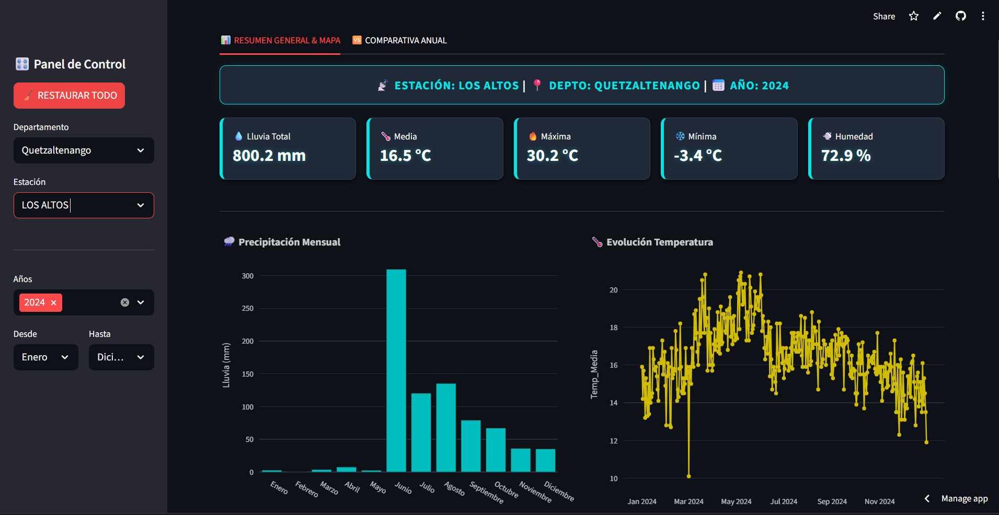

# 🇬🇹 Sistema de Monitoreo Climático Interactivo (INSIVUMEH)

> **Herramienta de Inteligencia de Negocios (BI) aplicada al sector AgroTech de Guatemala.**

🚀 **[VER DASHBOARD EN VIVO (Click Aquí)](https://dashboard-clima-guatemala-bewnkfvypafure26wqwpxu.streamlit.app/)**

---

## 📋 Sobre el Proyecto
Este proyecto nació de la necesidad de democratizar el acceso a la información climática histórica de Guatemala. Procesando datos del **INSIVUMEH (1990-2024)**, desarrollé una aplicación web que permite visualizar patrones de precipitación, temperatura y humedad relativa para mejorar la planificación de cultivos.

## 📸 Galería del Sistema

### 1. Panel de Control Geoespacial

*Mapa interactivo que permite filtrar datos seleccionando estaciones georreferenciadas. Incluye KPIs (Lluvia total, Temperaturas, humedad relativa).*

### 2. Análisis Comparativo Histórico

*Módulo diseñado para contrastar el comportamiento del clima entre diferentes años*

### 3. Ubicación Geográfica de las Estaciones

*Red de estaciones meteorológicas del INSIVUMEH*

---

## 🔧 Ingeniería de Datos y Desarrollo del Backend

Más allá de la visualización, el núcleo de este proyecto reside en un robusto proceso de ingeniería para transformar datos meteorológicos crudos en información accionable:

* **Data Wrangling con Pandas:** Implementé un flujo de trabajo para procesar registros históricos (1990–2024), realizando la limpieza de inconsistencias, normalización de nombres de estaciones y gestión de valores nulos (NaN) para asegurar la integridad analítica.
* **Refinamiento Lógico e Iterativo:** El código fuente fue desarrollado a través de múltiples ciclos de iteración, optimizando la lógica de los filtros dinámicos y la arquitectura de las funciones para garantizar un rendimiento fluido y escalable.
* **Optimización de Almacenamiento (Gzip):** Para superar las limitaciones de carga en la nube, se migró la base de datos de formatos pesados (Excel 25MB) a **archivos CSV con compresión Gzip**. Esto redujo el peso en un **80%**, permitiendo tiempos de respuesta inmediatos incluso en conexiones de baja velocidad.
* **Arquitectura Escalable:** El backend está diseñado de forma modular para facilitar la integración anual de nuevos datasets (como el próximo ciclo 2025) sin necesidad de reescribir la lógica principal del sistema.
* **Despliegue e Integración Continua (CI/CD):** Configuré una conexión directa entre este repositorio y **Streamlit Cloud**, permitiendo que cada mejora en el código fuente se refleje automáticamente en la aplicación en vivo.

## 🛠️ Stack Tecnológico
* **Lenguaje:** Python 3.10+
* **Core:** Pandas & NumPy (Procesamiento vectorial)
* **Visualización:** Plotly Express (Gráficos interactivos) & Streamlit (Framework Web)

---

## 🚀 Roadmap y Visión a Futuro

Este proyecto se concibe como una herramienta evolucionable. El desarrollo está planificado en las siguientes etapas clave:

### 🛰️ Fase 2: Inteligencia Espacial y ML (2026)
* **Imputación de datos con Machine Learning:** Implementación de modelos de **Random Forest** para completar de forma científica los vacíos históricos en las series de datos.
* **Interpolación Dinámica:** Integración de `leafmap` y modelos de interpolación (**Kriging / IDW**) para generar mapas de superficies climáticas continuas, permitiendo estimar valores en zonas sin estaciones cercanas.

### 🤖 Fase 3: Automatización Total (Largo Plazo)
* **Pipeline de Datos Automatizado:** Integración con herramientas de orquestación (n8n/Python) para la captura y limpieza automática de datos climáticos.
* **Análisis en Tiempo Real:** Transición de un dashboard de consulta histórica a un sistema de monitoreo y alertas climáticas en tiempo real para el sector agrícola.
---

## 👨‍💻 Autor
**José Esquina**

*Especialista en Investigación Agrícola | Python & GIS | Transformación Digital*

[Enlace de contacto en Linkedin](www.linkedin.com/in/jose-esquina-0350aa159)
